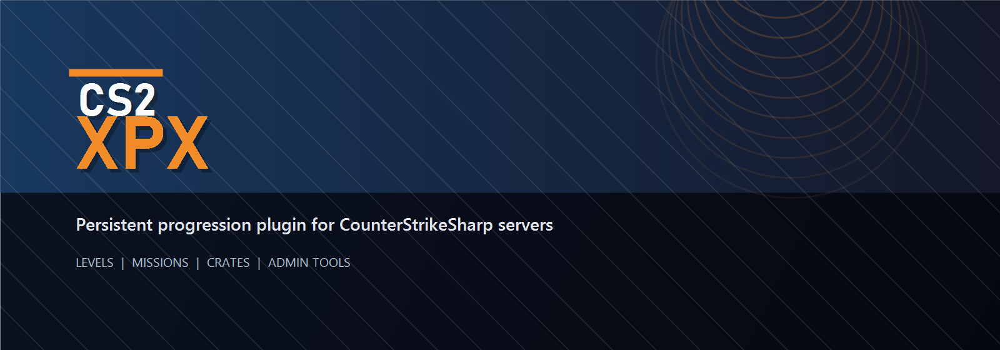
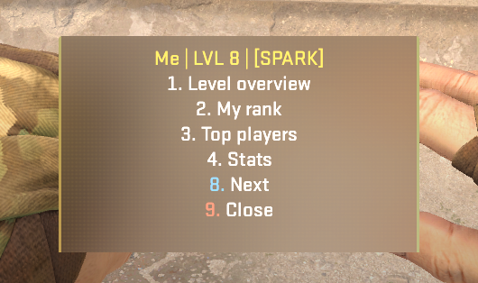
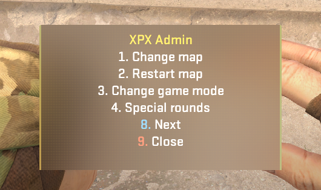
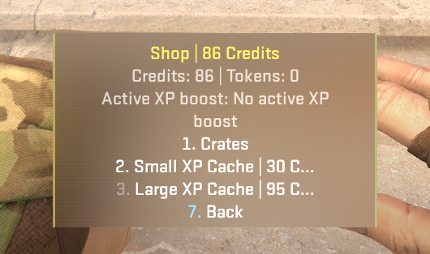
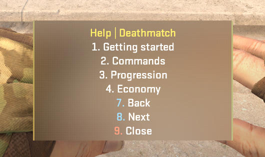
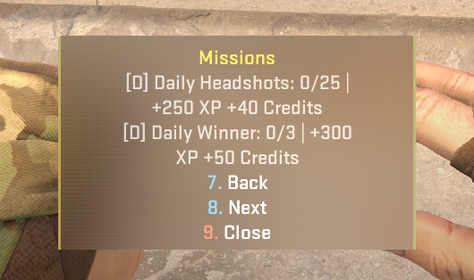
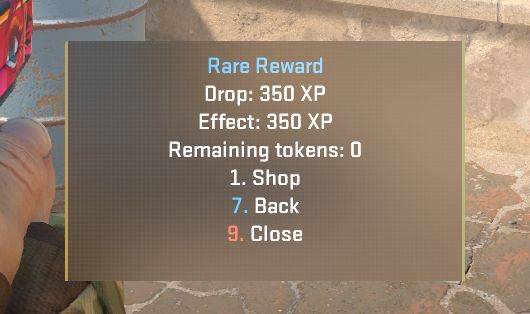

# XPX

> Persistent progression, missions, economy, and admin tooling for serious CS2 community servers.




XPX is a CounterStrikeSharp plugin for Counter-Strike 2 that adds a full server-side progression layer:

- level and XP progression up to level `500`
- rank, top list, tags, and level rewards
- persistent SQLite-backed player data
- missions, achievements, stats, economy, shop, crates, and XP boosts
- RTV and admin map voting
- admin tools for maps, modes, XP, credits, bots, and special rounds
- forced global loadout modes for rifle, pistol, or knife-only servers

The plugin is designed for self-hosted CS2 community servers and is currently deployed with a local Windows + SteamCMD setup.

## License and Usage

XPX is source-available and proprietary.

- personal or internal server use is allowed
- redistribution, resale, sublicensing, repackaging, and public reposting are not allowed
- modified copies must not remove or obscure the original authorship, branding, or attribution
- derivative versions must not be presented as an unrelated original work

See [LICENSE.md](LICENSE.md) for the full notice.

## Preview

| Player Hub | Admin Menu | Shop / Crates |
| --- | --- | --- |
|  |  |  |

| Help | Missions | Crate Reward |
| --- | --- | --- |
|  |  |  |

## What XPX Includes

### Core progression

- XP from kills, wins, bomb plants, bomb defuses, assists, MVPs, first blood, clutches, killstreaks, and multikills
- separate rewards for normal modes and fast modes such as Deathmatch / Arms Race
- bot XP scaling
- warmup XP disabled
- persistent level, tag, and reward state per SteamID

### Player systems

- `!me`, `!rank`, `!level`, `!top`
- `!stats` with K/D, HS%, playtime, favorite weapon, streaks, and economy state
- `!missions` for daily and weekly mission progress
- `!achievements` for permanent badge unlocks
- `!shop`, `!wallet`, and `!inventory`
- `!gamble <xp>`

### Economy and crates

- server-side Credits economy
- shop purchases for XP and crate tokens
- weighted crate drops with `Common`, `Rare`, `Epic`, and `Legendary` tiers
- crate rewards are limited to XP, Credits, crate tokens, and temporary XP boosts
- active boosts persist and expire automatically

### Server and admin tools

- `!rtv` / `!vote` map voting
- map and workshop map rotation
- admin menu with map, mode, vote, bot, XP, and credit actions
- special rounds such as knife rounds, pistol rounds, and warmup events
- forced server-wide loadout mode for all players
- global toggle for progression notifications

## Requirements

- Counter-Strike 2 dedicated server
- CounterStrikeSharp
- .NET 8 SDK for local builds
- Windows PowerShell if you want to use the included deploy script as-is

NuGet packages used by this project:

- `CounterStrikeSharp.API 1.0.364`
- `Dapper 2.1.72`
- `Microsoft.Data.Sqlite 10.0.5`

## Install Options

### Option A: Clone the repo

If you have repository access, clone it normally:

```powershell
git clone https://github.com/Azuyah/XPX.git
cd XPX
```

### Option B: Manual install from a ZIP

If you do not have repository access, you cannot clone a private repo directly.

Use one of these instead:

1. download a provided release ZIP
2. get a plugin ZIP directly from the maintainer
3. extract it locally
4. copy the plugin files into your CS2 CounterStrikeSharp plugin folder

Recommended current package name:

```text
XPX-v1.0.2-plugin.zip
```

See [docs/SETUP.md](docs/SETUP.md) for the manual install path.

## Quick Start

### 1. Build the plugin

```powershell
dotnet build
```

### 2. Deploy it

If your server layout matches the current local setup, use:

```powershell
powershell -ExecutionPolicy Bypass -File .\deploy-to-r-server.ps1
```

By default the deploy script targets:

- server root: `R:\cs2-ds`
- plugin path: `R:\cs2-ds\game\csgo\addons\counterstrikesharp\plugins\XPXLevels`
- config path: `R:\cs2-ds\game\csgo\addons\counterstrikesharp\configs\plugins\XPXLevels\XPXLevels.json`
- data path: `R:\cs2-ds\game\csgo\addons\counterstrikesharp\data\XPXLevels`

### 3. Join the server

Typical local connect:

```text
connect 127.0.0.1:27015
```

## Main Commands

### Player commands

- `!me`
- `!help`
- `!commands`
- `!level`
- `!rank`
- `!top`
- `!stats`
- `!missions`
- `!achievements`
- `!shop`
- `!wallet`
- `!inventory` / `!inv`
- `!rtv`
- `!vote`
- `!gamble <xp>`

### Admin commands

- `!admin`
- `css_givexp`
- `css_removexp`
- `css_givecredits`
- `css_removecredits`
- `css_changemap`
- `css_restartmap`
- `css_setmode`
- `css_kick`
- `css_kickbots`
- `css_addbots`
- `css_forceloadout`
- `css_forcevote`
- `css_cancelvote`
- `css_kniferound`
- `css_pistolround`
- `css_warmupevent`

For the complete command reference, see [docs/COMMANDS.md](docs/COMMANDS.md).

## Configuration

XPX is driven by `XPXLevels.json`. The config covers:

- XP curve and max level
- XP rewards and credits rewards
- mission definitions
- achievement definitions
- shop items
- crate definitions
- map pool and workshop map pool
- admin XP quick-amount presets
- level reward ladder
- welcome messages

For a detailed config guide, see [docs/CONFIGURATION.md](docs/CONFIGURATION.md).

## Persistence

XPX stores player progression in SQLite by SteamID. It persists:

- XP
- level-derived state
- Credits
- crate tokens
- XP boosts
- stats
- missions
- achievements

The live DB path used by the deploy script is:

```text
game\csgo\addons\counterstrikesharp\data\XPXLevels\xpx-levels.db
```

XPX also keeps a short-lived transition snapshot during map changes to protect player XP from map-switch reload edge cases.

## Repository Layout

```text
XPXLevels.csproj
XPXLevelsPlugin.cs       # core plugin flow, menus, XP, map vote, admin tools
XPXLevelsFeatures.cs     # stats, missions, achievements, shop, crates, special rounds
XPXLevelsConfig.cs       # config schema and default values
XPXLevelsModels.cs       # shared models and enums
XPXLevelsRepository.cs   # SQLite persistence layer
XPXNumberMenu.cs         # custom center-screen numbered menu renderer
deploy-to-r-server.ps1   # local build + deploy + restart helper
docs/
```

## Development

Common local workflow:

```powershell
dotnet build
powershell -ExecutionPolicy Bypass -File .\deploy-to-r-server.ps1
git status
git add .
git commit -m "Describe the change"
git push origin main
```

More detail lives in [docs/DEVELOPMENT.md](docs/DEVELOPMENT.md).

## Additional Docs

- [docs/SETUP.md](docs/SETUP.md)
- [docs/COMMANDS.md](docs/COMMANDS.md)
- [docs/CONFIGURATION.md](docs/CONFIGURATION.md)
- [docs/DEVELOPMENT.md](docs/DEVELOPMENT.md)
- [docs/releases/v1.0.2.md](docs/releases/v1.0.2.md)
- [docs/releases/v1.0-xponly.md](docs/releases/v1.0-xponly.md)

## Notes

- XPX uses custom numbered center menus with `1-9`, plus `!1-!9` chat fallback.
- Workshop maps are supported by workshop ID.
- Local non-workshop custom maps require separate client distribution and are not the preferred path.
- The project currently targets a Windows-hosted local CS2 dedicated server workflow.
